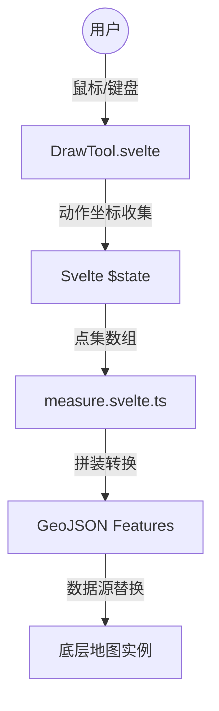

# 绘制工具 (DrawTool) 开发维护文档

## 1. 功能概述

绘制工具 (`DrawTool`) 利用 MapLibre 实例，通过 GeoJSON 原生方式在 Web 地图上提供交互式的地理标记功能，支持以下模式：

- **单次放置 (point)**：对地图左键点击立即增加有效锚点位置。
- **连续连线 (line)**：支持多点连续采集路径，在移动鼠标的途中引擎会呈现平移下的预连接虚线辅助边界。
- **采集面域 (polygon)**：支持包含面积遮罩的面域坐标采集。

## 2. 核心文件结构

- `src/lib/components/draw/DrawTool.svelte`: UI 组件，负责地图图层渲染注入、交互事件监听（单双击收集）和 Svelte 5 的响应式封装及释放。
- `src/lib/components/measure/measure.svelte.ts`: 纯函数支持库（复用），内含用于将原始坐标序列阵列构建转化为对应 GeoJSON Feature 格式的生成函数 (`buildLineGeoJSON`, `buildPolygonGeoJSON` 等)。

## 3. 技术实现要点

### 3.1 状态驱动机制 (Svelte 5)

- 抛弃传统命令式的多状态挂载模式，完全利用 Svelte 5 的 `$state` 和 `$props` 配合 `$effect` 管理。当 `mode` 状态切换为激活绘制，底层副作用闭包即可自动接管资源绑定与图层注入（`setupLayers` / `cleanup`）。
- **`currentPoints`** 储存当前还在采集在途中的阵列，**`allFeatures`** 作为持久化储存完成特征组，保证状态和渲染的解耦。

### 3.2 虚拟与持久图层的解耦渲染

由于地图绘制存在高频的鼠标指针跟随游走 (`handleMouseMove`)，混用图层会引起极大的重绘性能瓶颈：

- **真实图层 (`SOURCE_ID`)**: 用来持久化载入用户确认完毕、或是阶段性组装完成的多边形及连线拐点。
- **预览图层 (`PREVIEW_SOURCE_ID`)**: 只包含跟随鼠标高频更新位置重设的一段尾部辅助虚线，通过剥离独立的数据源来实现视觉的丝滑交互更新。

### 3.3 交互剪裁与 DRY

- Web 鼠标在触发 `dblclick` 闭合图形时，必然伴随最后两次多余的点击 `click`。系统通过在双击后执行截取剪裁 `currentPoints.slice(0, -1)` 执行废弃垃圾锚点的安全脱离计算。
- 共用抽象封装生成的 `GeoJSON` 函数体系保证了该绘制组件本身代码专注于调度事件状态机机制。

## 4. 交互说明

1. **左键单击**: 收集新线段点、转折锚点或直接释放单点。
2. **移动鼠标**: 沿用虚线显示当前与前序最末位结点的实时跟随相连导向轨迹。
3. **双键双击**: 终结本段（线或面）连续组建收集流，剔除重合脏数据且直接转入常驻固定层中。
4. **Escape 键**: 中途强制剥离事件监听并清空抛弃当前进行到一半的历史遗留数据列。

## 5. 注意事项

- 组件无需在父级视图 HTML 层注入复杂的节点映射代码，所有重排负担仅下放到 MapLibre 实例，且通过全局单实例方式接收 `map` 作为基础 Prop。
- 当上层视图传入的 `mode` 为 `null` 时，本系统会自动释放内存、收回监听器并卸载自身添加的专属图层资源。
