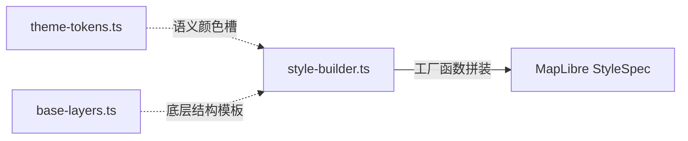

# 地图主题样式系统 开发维护文档

## 1. 系统概述

在重构之前，项目中存在 `blue.json`、`dark.json`、`light.json` 三个独立的地图样式文件。由于地图图层结构（Layers）高度一致（约 500+ 行代码），仅在颜色（Paint 属性）上有所差异，产生严重的重复。
本地图主题样式系统旨在通过 **"Token + 模板"** 的现代化架构，实现系统代码结构上的纯状态逻辑与视觉配色方案剥离，使得全局主题呈现统一并提供高扩展性。

## 2. 核心架构结构

主题样式组装基于多重逻辑层级：

- `src/lib/map/theme-tokens.ts`: **输入层**，定义配色语义化 Token 接口约束及包含所有的各个配色主题静态变量体。
- `src/lib/map/base-layers.ts`: **模板公共层**，维护整个规范图层结构中稳定存在的要素如 zoom、filter、通用表现层基础规则，仅为颜色值插槽提供空位。
- `src/lib/map/style-builder.ts`: **处理构建器层**，对外导出生成工厂函数，接收主题模式命令并将 Tokens 融合入层。

## 3. 技术实现要点

### 3.1 配色语义 Token 设计 (`theme-tokens.ts`)

- 抽象设计基础环境色彩（如 `background`, `water`, `roadPrimary` 等）。
- 使用 TypeScript 原生 Interface 严格对齐数据维度，使增加新风格只需求配对颜色，编译器即可发现漏填的情况。

### 3.2 图层公共模板 (`base-layers.ts`)

- **结构防冗余**: 诸如插值算法、条件过滤器 (`filter`)与渲染排列 (`layout`) 等一千行级别的公共控制只在这里维护一份。
- **现代化提取**: 利用 `coalesce` 跨界跨库适配逻辑进行兼容表达式化调优，合并和减少图层生成数量。所有的 `paint.color` 配置均为动态通过引用的传入注入。

### 3.3 构建与输出流 (`style-builder.ts`)

作为 `buildMapStyle(themeName)` 指令的归口函数，它会依据所需主题去取回对应 Token，与模板数据动态交织、整合包含 `sprite`, `sources`, `sky` 等必要的顶层节点规范，实时下发被 MapLibre 完全无缝解析运行。

## 4. 主题扩展与自定义说明

得益于该框架的设计范式，目前若需要增加甚至用户端动态下发配色系统：

1. 打开 `src/lib/map/theme-tokens.ts` 定义一个新的 `ThemeTokens` （如：护眼主题）。
2. 在 `THEMES` 记录簿对象内添加这唯一的对应对象结构。
3. 直接通过前端 Svelte 状态变更发起 UI 指令让其自动调用，全系统热重载而无需多余 HTTP 解析负荷。

## 5. 注意事项

- **Sky 对象兼容丢弃风险**：某些编译引擎可能会将非标准的属性如 `sky` 从 `StyleSpecification` 推导内剔除，目前通过转换为 `Record<string, unknown>` 联合体断言的形式进行绕过支持。
- **Satellite 特例兼容**：该设计用于底图抽象扁平化渲染。针对带 Raster 栅格分片的真实卫星影像由于其底层 Source 源结构完全异构，不建议强行挂树封装统一配置。针对卫星版结构仍须预留独立原生 JSON 的引入空间。
