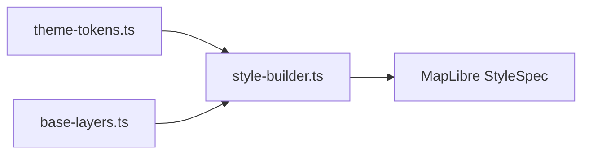

# 地图主题样式系统设计文档

## 1. 系统背景

在重构之前，项目中存在 `blue.json`、`dark.json`、`light.json` 三个独立的地图样式文件。由于地图图层结构（Layers）高度一致（约 500+ 行），仅在颜色（Paint 属性）上有所差异，导致了严重的冗余。

本系统旨在通过 **"Token + 模板"** 的架构，实现样式逻辑与配色方案的分离，提升可维护性和扩展性。

## 2. 核心架构

系统采用「模块化组装」思路：

### 架构示意图 (Mermaid)



### 逻辑层级说明

| 层级       | 模块文件             | 核心职责                                     |
| :--------- | :------------------- | :------------------------------------------- |
| **输入层** | `theme-tokens.ts`    | 定义配色语义化 Token (如: background, water) |
| **模板层** | `base-layers.ts`     | 维护公共图层结构 (如: zoom, filter)          |
| **处理层** | `style-builder.ts`   | 执行 `buildMapStyle` 将以上两者合并          |
| **结果层** | **Map Style Object** | 最终输出给 MapLibre 的样式规范               |

### 2.1 配色 Token (`theme-tokens.ts`)

- **作用**：定义地图颜色的语义化变量（如 `background`, `water`, `roadPrimary` 等）。
- **实现**：使用 TypeScript Interface 约束，确保每个主题都包含必要的配色字段。
- **配置**：现有的 `Blue`、`Dark`、`Light` 主题即在此处定义配色方案。

### 2.2 图层模板 (`base-layers.ts`)

- **作用**：定义地图的所有可视化层。
- **特点**：
  - 结构固定：filter、layout、minzoom、插值算法等只在这里维护一次。
  - 动态填空：所有的 `paint.color` 均从配置好的 Token 中读取。
  - 现代语法：统一采用 `coalesce` 跨语言显示逻辑，减少重复图层。

### 2.3 样式构建器 (`style-builder.ts`)

- **作用**：主入口函数 `buildMapStyle(themeName)`。
- **逻辑**：
  1. 根据主题名获取对应 Token。
  2. 生成图层数组。
  3. 组装顶层属性（sprite, sources, sky等）。
  4. 返回可直接被 MapLibre 消费的对象。

## 3. 核心优势

- **DRY (Don't Repeat Yourself)**：图层结构只维护一份，不再需要在多个 JSON 间同步修改。
- **扩展性强**：新增主题只需定义一组约 50 行的颜色数组，无需复制 500+ 行 JSON。
- **配置化**：可在运行时动态切换主题（Svelte 状态驱动），无需发起 HTTP 请求获取 JSON。
- **类型安全**：借助 TypeScript，拼写错误或缺失颜色字段会在编译阶段被拦截。

## 4. 如何新增主题

1.  打开 `src/lib/map/theme-tokens.ts`。
2.  定义一个新的 `ThemeTokens` 对象。
3.  在 `THEMES` 注册表中添加新主题键。

```typescript
const MyNewTheme: ThemeTokens = {
    name: "新主题",
    background: "#ff0000",
    // ... 其他配色
};

export const THEMES = {
    // ...
    MyNewTheme
};
```

## 5. 常见问题记录

- **Sky 不显示**：`StyleSpecification` 类型在某些环境下可能会过滤掉非标准字段。现在通过构造 `Record<string, unknown>` 对象并最终转型的方式，确保 `sky` 属性在构建过程中被正确保留。
- **Satellite 主题**：卫星图涉及 raster 分片和不同的 source 结构，不建议强行归纳。目前保留独立 JSON 加载方式。
